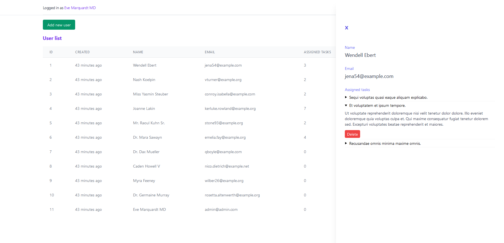

## Task management web app

Simple Laravel REST API + Vuejs web application. It has admin and user sections, with admin being able to create, edit, delete, update users and tasks. User can only edit task status that has been assigned to him.

---

## Features
* [x] Application has admin and user logins
* [x] Laravel best practices (Repository pattern, SOLID, DRY, TDD)
* [x] Mobile friendly
* [x] REST API Tested with phpunit
* [x] Admin can CRUD task
* [x] Admin can CRUD user
* [x] User can change task status
* [x] Protected admin routes

---

## Stack
📦 [Laravel Permissions](https://spatie.be/docs/laravel-permission/v3introduction)  
📦 [Sanctum](https://laravel.com/docs/8.x/sanctum)   
📦 [Vuejs](https://vuejs.org/)   
📦 [Tailwindcss](https://tailwindcss.com/)   

---

## Installation

Information how to run REST API and Vuejs frontend is in the corresponding directories

---

## Screenshots
**Login**

**Admin dashboard tasks**

**Admin dashboard tasks show task**

**Admin dashboard tasks edit task**

**Admin dashboard users**

**Admin dashboard users show users info**

**User dashboard**

**User dashboard change status**

